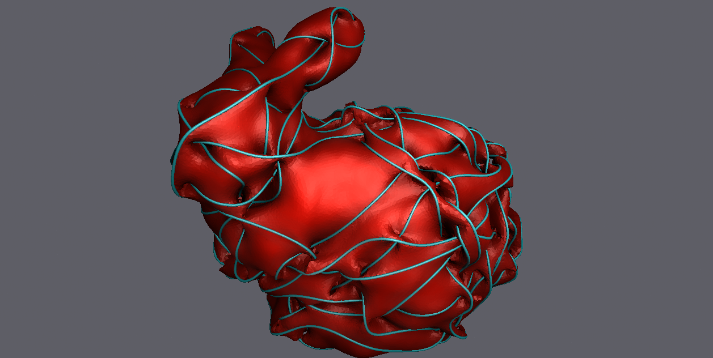

<!-- ABOUT THE PROJECT -->
# libGaudi

  

## About

libGaudi is a topological dynamic mesh library.  In addition to handling the common edge splits and collapses, it also handles an edge-edge merge.  Why not just use [El Topo](https://www.cs.ubc.ca/labs/imager/tr/2009/eltopo/eltopo.html)? libGaudi handles topological merges a little differently, via vertex merge and edge rotation.  Its perhaps a little more elegant than the topological operation El Topo uses... but there is also a lot of other stuff thats fun to use.  The mesh structure is completely pointerless and dataless.  Data is handled as a seperate class with custom predicates to determine what happens when the topology changes. 

### Project Features:
* Almost completely headerless, except for a singleton visual debugging logger
* Pointerless, dataless, half edge mesh data structure
* Data is stored in seperate arrays with the ability to add custom split/collapse predicates, coordinates are not baked into the half edge structure
* Generic BVH tree for handling simplex structures
* Hierarchical integrator for solutions to Poisson equation / Boundary integrals
* Fast Winding Number solver
* Surface Direction Field solver
* Geodesic Heat Solver
* Projection based mesh solver similar to [ShapeOp](https://www.shapeop.org/) for rods and meshes which supports implicit collisions and some other interesting constraints
* Geodesic walks on the mesh surface and subsequent subdivision while preserving underlying data
* Debugging is an immediate-mode like logger that lets you push a handful of primitives to be rendered each frame using geometry shaders.
* Screen Space Ambient Occlusion

### Future work:
* Improve predicates to properly handle face/edge data
* No parallelism/No GPU, that stuff takes time and is tricky with graph data structures, but I want to?
* BVH parallism, improve confusing API
* Repulsive Curves/Surfaces solver
* Surface Reaction Diffusion solver
* Biased Poisson solve based on input direction field
* Combined Rods/Mesh projection solver
* Add ability to scrape the debug logger to make completely headerless
* Screen Space Color Bleed
* How about a full path tracer?
* Seperate the viewer into a seperate project

### Dependencies:
  viewer: Nanogui, GLFW, Eigen, 
  Mesh Library: Eigen
    
### Some examples:

  
  
  
  
  
  

(<a href="#readme-top">back to top</a>)

