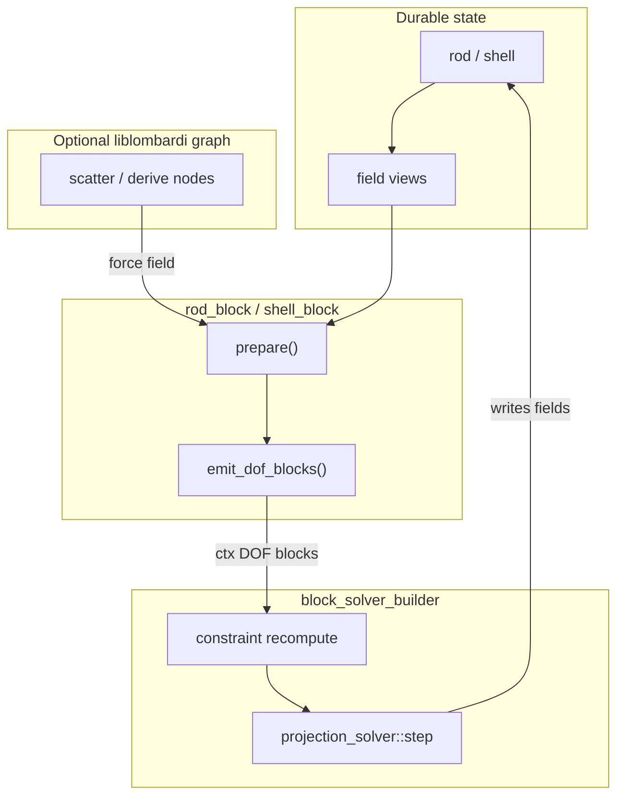

# Solver Node Composition Pattern TDD

## Overview

Fluent builder pattern for composing hepworth block-solver steps. Constraint
factories capture mesh/field/block state at setup time and return **per-step
recompute functions** that rebuild the constraint list from current geometry
before each `projection_solver::step()`.

The durable simulation boundary is **fields** (and geometry handles). Hepworth
`vec3_block` / `quat_block` objects are **ephemeral DOF views** emitted each
frame from field-backed **`rod_block` / `shell_block` wrappers**. The builder
registers those wrappers via `with_block()`, not pinned hepworth block pointers.

**Depends on**: `ext/liblombardi/` datum pool + graph context (done).

**Primary migration target**: [`rod_constraints_test.hpp`](include/gaudi/duchamp/rod_constraints_test.hpp)
(rod stiff solver, two DOF blocks: vec3 + quat). Knotted surface is deferred.

> **Status (revised 2026-06).**
>
> | Layer | Status |
> |---|---|
> | `ext/liblombardi/` graph, ports, `PortRef`, tests | **Done** |
> | `liblombardi/composite_nodes.hpp` (`map_plus_two_group`) | **Done** |
> | `include/gaudi/duchamp/fields.hpp` shell field system | **Done** |
> | `include/gaudi/duchamp/field_nodes.hpp` (`field_datum`, `march_node`) | **Done** |
> | `hepworth::block::projection_solver` + `init_*` constraints | **Exists** (manual wiring in demos) |
> | `block_solver_builder`, `bundles.hpp`, `block_solver_node` | **Done** (v1 shell; needs `rod_block`/`shell_block` refactor) |
> | `rod_fields.hpp`, `rod_block`, rod bundles | **Planned** |
> | `shell_block`, scatter nodes, knotted_surface migration | **Later** |

See also: [`field_wrappers_tdd.md`](field_wrappers_tdd.md) for the field layer.

### Terminology: two kinds of "block"

| Term | What it is | Lifetime |
|---|---|---|
| **`rod_block` / `shell_block`** | Field-backed simulation wrapper; registered on config via `with_block()` | Durable |
| **`vec3_block` / `quat_block`** | Hepworth DOF adapter (`hepworth::sim_block`); refs into field storage | Ephemeral, emitted each step |

`block_solver_config::blocks` holds `rod_block` / `shell_block` wrappers.
`solver_context::dof_blocks` (or `ctx.blocks` in code) holds emitted hepworth
`sim_block::ptr` for `projection_solver::step()`.

---

## Core model: fields vs blocks

| Layer | Lifetime | Role |
|---|---|---|
| Geometry (`shell::ptr`, `rod::ptr`) | Durable | Topology + raw storage |
| Fields (`shell_vert_positions`, `rod_corner_positions`, …) | Durable | Stable handles; `get()` reflects current state |
| Derived per-frame buffers (mass, forces, rest-length tweaks) | Refreshed each step | Geometry-dependent; owned by `rod_block` / `shell_block` |
| `vec3_block` / `quat_block` | Ephemeral | Hepworth DOF adapter — refs into the above |
| Constraints | Rebuilt each step | `init_*` from current DOF blocks + geometry |

**Do not** store hepworth `sim_block::ptr` on `block_solver_config` at setup
time. DOF blocks go stale when mass is recomputed or force buffers are zeroed.
Fields and `rod_block` / `shell_block` wrappers do not.

### Durable capture (not a functional pipeline)

Recompute factories and presolve lambdas are **closures built once** at setup.
Unlike a React-style render tree, there is no fresh props object each frame —
simulation state **mutates in place** on durable storage. Whatever a factory
captures must remain a **live handle** to that storage across frames.

| Capture at setup | OK? | Why |
|---|---|---|
| `rod::ptr`, `shell::ptr`, `shell_block_ptr`, `rod_block_ptr` | Yes | Points at objects whose members mutate each step |
| `dynamic::ptr` | Yes | Broadphase state updated outside nodal compute |
| Field view on a block (`shell->positions().get()` inside lambda) | Yes | `get()` re-reads current storage each invocation |
| `std::vector<vec3>` by value, copied `l0`, snapshot positions | **No** | Stale after first mutation |
| hepworth `vec3_block::ptr` | **No** | Ephemeral; rebuilt each `emit_dof_blocks()` |
| `real w`, indices, topology ids | Yes | Immutable setup parameters |

```cpp
// GOOD — capture handle; read data at invoke time
return [rod, w](solver_context& ctx) {
  init_stretch_shear(*rod, ctx.constraints, rod->l0(), w, {ctx.blocks[0], ctx.blocks[1]});
};

// BAD — snapshot l0 at factory creation time
std::vector<real> l0_snapshot = rod->l0();
return [l0_snapshot, w](solver_context& ctx) { /* stale after grow_rest_lengths */ };
```

The graph layer (`field_datum`, scatter nodes) follows the same rule: ports alias
**durable buffers** in the datum pool or mesh-owned storage. Nodes read/write
through those aliases each `compute()` — they do not receive immutable copies of
simulation state unless explicitly copying is the intended semantics (e.g. a
march node writing to a separate output buffer).

Config, factories, and registered `rod_block` / `shell_block` wrappers are built
**once per simulation**, not rebuilt each frame. Only constraints, DOF block
wrappers, and derived per-step buffers (forces, mass) are refreshed inside
`run_solver_step`.


```cpp
// 1. presolve — forces, l0 growth
std::vector<vec3> f = ...;
for (int i = 0; i < l0.size(); ++i) l0[i] *= 1.04;

// 2. emit DOF blocks — ephemeral views
auto x = vec3_block::create(__R->__M, __R->__x, __R->__v, f);
auto u = quat_block::create(__R->__J, __R->__u, __R->__o);

// 3. recompute constraints
init_stretch_shear(*__R, constraints, l0, w, {x, u});
init_bend_twist(*__R, constraints, w, {u});
init_collisions(*__R, *__Rd, constraints, w, {x, x});

// 4. solve
solver.step({x, u}, h, damping);

// 5. outside solver composition — collision broadphase / dynamic update
__Rd->step();  // NOT inside block_solver_node::compute() or run_solver_step
```

---

## API reconciliation

Earlier drafts referenced APIs that do not exist. The real code is:

| Earlier draft | Real API |
|---|---|
| `asawa::hepworth::block::solver` | `gaudi::hepworth::block::projection_solver` (`hepworth/block/solver.hpp`) |
| `solver->add_constraint(c)` | Build `std::vector<hepworth::projection_constraint::ptr>`, then `solver.set_constraints(constraints)` |
| `asawa::hepworth::constraints::make_stretch` | `hepworth::block::init_triangle_strain`, `init_bending`, etc. (`hepworth/block/shell_constraints_init.hpp`) |
| `asawa::shell::create_cube()` | `asawa::shell::load_cube()` (`shell/asset_loader.hpp`) |
| `mesh->create_data<vec3>(prim_type::VERT)` | `asawa::init_vert_datum<vec3>(*mesh, v0)` or `datum_t<T>::create` + `insert_datum` (`datums.hpp`) |
| `prim_type::VERT` | `enum prim_type { VERTEX, FACE, EDGE, CORNER }` (`datums.hpp`) |
| `class node` with `register_input/register_output` | `liblombardi::Node` + `PortDef` + `PortRef` + `GraphContext::link` |
| `graph_context::set_input/get_output` | `GraphContext::link(from.output(), to.input())` + `node->get_datum<PortDef>()` |
| `with_block(hepworth::sim_block::ptr)` at setup | **`with_block(rod_block_ptr)` / `with_block(shell_block_ptr)`** — wrapper emits DOF blocks each step |

**Reference manual pattern** (heavy, deferred): [`knotted_surface.hpp`](include/gaudi/duchamp/modules/knotted_surface.hpp) rebuilds three DOF blocks + constraints inline every `step()` (~714–871).

---

## Architectural layers

```
Layer 0  Geometry + fields          rod::ptr, shell::ptr, field views
Layer 1  Scatter / derive nodes     f(positions) → normals, SDF → forces  [optional graph]
Layer 2  rod_block / shell_block    prepare() + emit_dof_blocks()
Layer 3  Constraint recompute fns    init_* using ctx DOF blocks
Layer 4  block_solver_builder       run_solver_step → projection_solver::step
```



---

## Design

### 1. liblombardi node base (implemented)

```cpp
// ext/liblombardi/include/liblombardi/node_base.hpp
class NodeBase {
    virtual void compute() = 0;
    virtual uint port_count() const { return 0; }
    GraphContextBase* context() const;
};

struct Node : NodeBase {
    template <typename PortDef>
    std::shared_ptr<typename PortDef::buffer_type> get_datum();
};
```

Wiring uses typed port handles:

```cpp
liblombardi::GraphContext ctx;
auto gen = ctx.create_node<GeneratorNode>(5);
ctx.link(gen->output(), map->input());
ctx.run();
```

Shared-context composites live in
[`ext/liblombardi/include/liblombardi/composite_nodes.hpp`](ext/liblombardi/include/liblombardi/composite_nodes.hpp).

### 2. Shell field system (implemented)

See [`include/gaudi/duchamp/fields.hpp`](include/gaudi/duchamp/fields.hpp).

```cpp
using shell_vert_positions  = bound_field<shell_mesh, vec3, asawa::prim_type::VERTEX>;
using shell_vert_velocities = bound_field<shell_mesh, vec3, asawa::prim_type::VERTEX>;
using shell_vert_normals    = surface_following_field<shell_mesh, vec3, asawa::prim_type::VERTEX>;
```

Liblombardi bridge: [`include/gaudi/duchamp/field_nodes.hpp`](include/gaudi/duchamp/field_nodes.hpp)
(`field_datum<T>`, `march_node`).

### 3. Rod field accessors (planned)

Rod state lives on `asawa::rod::rod` directly (`__x`, `__v`, `__M`, `__J`,
`__u`, `__o`, `__l0`), corner-indexed — not mesh datums. Rod fields mirror the
shell `field_base` interface by binding to rod member accessors.

| Quantity | Rod member | Indexing | Hepworth DOF block |
|---|---|---|---|
| positions | `x()` | corner | vec3 |
| velocities | `v()` | corner | vec3 |
| masses | `M()` | corner | vec3 |
| quat DOF | `u()` | corner | quat |
| quat offset | `o()` | corner | quat |
| inertia | `J()` | corner | quat |
| rest length | `l0()` | corner | constraint param |

```cpp
// include/gaudi/duchamp/rod_fields.hpp
enum class rod_channel { position, velocity, mass, rest_length };
enum class rod_quat_channel { frame, offset, inertia };

template <rod_channel C>
struct rod_corner_field
    : field_base<asawa::rod::rod, vec3, asawa::prim_type::CORNER> { ... };

template <rod_quat_channel C>
struct rod_quat_field
    : field_base<asawa::rod::rod, quat, asawa::prim_type::CORNER> { ... };

using rod_corner_positions  = rod_corner_field<rod_channel::position>;
using rod_corner_velocities = rod_corner_field<rod_channel::velocity>;
using rod_corner_masses     = rod_corner_field<rod_channel::mass>;
using rod_rest_lengths      = rod_corner_field<rod_channel::rest_length>;
using rod_quat_frames       = rod_quat_field<rod_quat_channel::frame>;
```

Implementation: template specialization or `switch` on channel enum mapping to
`rod->x()`, `rod->v()`, etc. Same polymorphic `field_base::ptr` as shell.

### 4. Hepworth DOF blocks (exists)

```cpp
// include/gaudi/hepworth/block/solver.hpp
namespace gaudi::hepworth::block {
class projection_solver {
    void set_constraints(const std::vector<projection_constraint::ptr>&);
    void step(std::vector<sim_block::ptr>& blocks,
              const real& h = 0.01,
              const real& damping = 0.5,
              const int& ITS = 50);
};
}
```

```cpp
// vec3_block / quat_block — holds refs into storage; forces typically wrapper-owned
auto x = vec3_block::create(M, xs, v, f);
auto u = quat_block::create(J, u_frames, u_offset);
```

Constraints via init helpers (`init_triangle_strain`, `init_stretch_shear`,
`init_bend_twist`, `init_collisions`, …). Each constraint implements
`project(const vecX& q, vecX& p)` and `fill_A(...)`.

### 5. `rod_block` / `shell_block` — field-backed wrappers (planned)

A `rod_block` or `shell_block` owns durable simulation state (fields + derived
buffers) and emits ephemeral hepworth DOF blocks each step. Both derive from a
common `block_wrapper` interface so `with_block()` accepts either.

```cpp
// include/gaudi/hepworth/blocks/block_wrapper.hpp
struct block_wrapper {
    virtual ~block_wrapper() = default;
    virtual void prepare(solver_context& ctx) = 0;
    virtual void emit_dof_blocks(std::vector<sim_block::ptr>& out) = 0;
};
using block_ptr = std::shared_ptr<block_wrapper>;
```

#### `rod_block`

```cpp
// include/gaudi/hepworth/blocks/rod_block.hpp
struct rod_block : block_wrapper {
    asawa::rod::rod::ptr rod;
    asawa::rod::dynamic::ptr dynamic;

    // Field views (created once, accessed via thin getters)
    rod_corner_positions::ptr  _positions;
    rod_corner_velocities::ptr _velocities;
    rod_corner_masses::ptr     _masses;
    rod_quat_frames::ptr       _frames;
    rod_quat_field<rod_quat_channel::offset>::ptr  _offsets;
    rod_quat_field<rod_quat_channel::inertia>::ptr _inertia;
    rod_rest_lengths::ptr      _rest_lengths;

    // Per-step ephemeral (wrapper-owned)
    std::vector<vec3> forces;

    void prepare(solver_context& ctx) override;
    void emit_dof_blocks(std::vector<sim_block::ptr>& out) override;

    vec3_block::ptr vec3() const;  // last emitted; for constraint factories
    quat_block::ptr quat() const;

    void apply_force_field(const std::vector<vec3>& external, real scale = 1.0);
    void grow_rest_lengths(real factor);

    // Thin accessors — same pattern as shell_block
    rod_corner_positions& positions() { return *_positions; }
    rod_rest_lengths& rest_lengths() { return *_rest_lengths; }
};
```

`prepare()` maps to rod_constraints_test presolve:

| Today in `step_dynamics` | `prepare()` |
|---|---|
| `f = fb + 1e-6 * fr` | `apply_force_field(...)` or presolve lambda / graph force field |
| `l0[i] *= 1.04` | `grow_rest_lengths(1.04)` |
| (implicit) | `forces.assign(n, Zero)` before accumulation |

`emit_dof_blocks()`:

```cpp
vec3_block::create(_masses->get(), _positions->get(), _velocities->get(), forces);
quat_block::create(_inertia->get(), _frames->get(), _offsets->get());
// append both to out — stable order: [vec3, quat]
```

`rod::dynamic` is used **during** constraint setup (`init_collisions` queries
`dynamic.get_internal_collisions()`). Its `step()` runs in the **outer simulation
loop**, after `run_solver_step` / `block_solver_node::compute()` returns — not
as a hook inside the solver composition layer.

#### `shell_block` (parallel track)

```cpp
// include/gaudi/hepworth/blocks/shell_block.hpp
struct shell_block : block_wrapper {
    asawa::shell::shell::ptr mesh;
    shell_vert_positions::ptr  _positions;   // internal field views
    shell_vert_velocities::ptr _velocities;
    std::vector<vec3> mass;
    std::vector<vec3> forces;

    // Thin accessors — light cast to underlying vec storage
    shell_vert_positions& positions() { return *_positions; }
    shell_vert_velocities& velocities() { return *_velocities; }

    void prepare(solver_context& ctx) override;
    void emit_dof_blocks(std::vector<sim_block::ptr>& out) override;
};
```

Replaces the interim `shell_vec3_block_state` helper.

**DOF block lifetime:** wrapper-owned force/mass buffers; **recreate hepworth
block objects each step** (matches knotted_surface mental model). Storage persists
on the wrapper; `vec3_block` / `quat_block` are ephemeral shells holding refs.

### 6. Solver context, hooks, and `run_solver_step`

```cpp
// include/gaudi/hepworth/block/solver_composition.hpp
struct solver_context {
    std::vector<sim_block::ptr> blocks;  // emitted DOF blocks (vec3_block, quat_block, …)
    std::vector<projection_constraint::ptr> constraints;
    real dt = 0.01;
    real damping = 0.5;
    int iterations = 10;
};

using presolve_fn = std::function<void(solver_context&)>;
using constraint_recompute_fn = std::function<void(solver_context&)>;
using constraint_bundle = std::vector<constraint_recompute_fn>;

struct block_solver_config {
    std::vector<block_ptr> blocks;  // registered rod_block / shell_block wrappers
    std::vector<presolve_fn> presolve;
    std::vector<constraint_recompute_fn> recompute;
    real dt = 0.01;
    real damping = 0.5;
    int iterations = 10;
};
```

`run_solver_step` contract (one projection solve — nothing after `solver.step`):

```
1. ctx.blocks.clear()
2. for each wrapper in config.blocks: wrapper->prepare(ctx)
3. for each config.presolve fn: fn(ctx)              // optional extras
4. for each wrapper in config.blocks: wrapper->emit_dof_blocks(ctx.blocks)
5. ctx.constraints.clear()
6. for each recompute fn: fn(ctx)                    // appends to ctx.constraints
7. solver.set_constraints(ctx.constraints)
8. solver.step(ctx.blocks, ctx.dt, ...)
```

**Outer simulation loop** (demo / module `step()`, not nodal compute):

```cpp
run_solver_step(config, solver);   // or ctx.run() if block_solver_node is in graph
__Rd->step();                      // dynamic broadphase — next frame's collision query input
```

Recompute fns use `void(solver_context&)` and append to `ctx.constraints`
(already implemented). Equivalent to returning `vector<constraint::ptr>`.

### 7. Constraint recompute factories

Setup-time factories capture **block wrappers** or geometry handles (`shell_block`,
`rod::ptr`, `dynamic::ptr`) — see [Durable capture](#durable-capture-not-a-functional-pipeline).
Each step they read `ctx.blocks` (emitted DOF blocks) and pull simulation data
from the wrapper via thin field accessors — a light `get()` / channel view over
`std::vector<T>`, not separate arguments for every quantity.

**Do not** pass peeled-off fields like `shell->positions` or `rod->rest_lengths`
to factories when the wrapper or geometry handle already implies them:

```cpp
// Shell — pass shell_block; positions read inside via field channel
constraint_recompute_fn make_shell_bending_recompute(shell_block_ptr shell, real w);
constraint_bundle make_shell_physics_bundle(
    shell_block_ptr shell, real stretch_w, real bending_w);

// Rod — pass rod (+ dynamic for collisions); l0 from rod->l0() at recompute time
constraint_recompute_fn make_rod_stretch_shear_recompute(asawa::rod::rod::ptr rod, real w);
constraint_recompute_fn make_rod_bend_twist_recompute(asawa::rod::rod::ptr rod, real w);
constraint_recompute_fn make_rod_collisions_recompute(
    asawa::rod::rod::ptr rod, asawa::rod::dynamic::ptr dynamic, real w);

constraint_bundle make_rod_physics_bundle(
    asawa::rod::rod::ptr rod, asawa::rod::dynamic::ptr dynamic,
    real stretch_w, real bend_w, real collision_w);
```

Example implementations:

```cpp
inline constraint_recompute_fn make_shell_bending_recompute(
    shell_block_ptr shell, real w) {
  return [shell, w](solver_context& ctx) {
    init_bending(*shell->mesh, ctx.constraints, shell->positions().get(), w,
                 ctx.blocks);
  };
}

inline constraint_recompute_fn make_rod_collisions_recompute(
    asawa::rod::rod::ptr rod, asawa::rod::dynamic::ptr dynamic, real w) {
  return [rod, dynamic, w](solver_context& ctx) {
    auto& x = ctx.blocks[0];  // lone rod_block emits [vec3, quat]
    init_collisions(*rod, *dynamic, ctx.constraints, w, {x, x});
  };
}
```

`shell_block` / `rod_block` own the field views (`positions()`, `velocities()`,
…). Factories and `init_*` callers use those accessors — same pattern as asawa's
direct `rod->x()` but routed through the block wrapper when in the composition
layer.

`ctx.blocks` order must match registration order of `with_block()` calls and each
wrapper's `emit_dof_blocks()` output (for a lone `rod_block`: `[vec3, quat]`).

### 8. Fluent builder + liblombardi node

```cpp
// include/gaudi/hepworth/nodes/solver_builder.hpp
class block_solver_builder {
public:
    static block_solver_builder create();
    block_solver_builder& with_block(block_ptr block);  // rod_block or shell_block
    block_solver_builder& with_presolve(presolve_fn fn);
    block_solver_builder& with_recompute(constraint_recompute_fn fn);
    block_solver_builder& with_bundle(const constraint_bundle& bundle);
    block_solver_builder& dt(real h);
    block_solver_builder& damping(real d);
    block_solver_builder& iterations(int n);
    block_solver_config build();
};

// include/gaudi/hepworth/nodes/block_solver_node.hpp
class block_solver_node : public liblombardi::Node {
public:
    explicit block_solver_node(block_solver_config config);
    void compute() override;  // run_solver_step
    unsigned int port_count() const override { return 0; }
};
```

### 9. Scatter / derive nodes (planned, graph layer)

When rods/shells are first-class data streams in the graph, **scatter nodes**
extract or derive state at different layers without coupling to the solver
internals.

| Node | Input | Output | Notes |
|---|---|---|---|
| `rod_positions_scatter` | `rod::ptr` or `rod_block` ref | `field_datum<vec3>` | positions at corner layer |
| `sdf_boundary_force` | positions + `sdf` | `field_datum<vec3>` | port of `compute_boundary_gradients` |
| `tangent_point_force` | rod + dynamic params | `field_datum<vec3>` | port of `compute_tangent_point_gradient` |
| `force_accumulate` | N force fields | `field_datum<vec3>` | `f = fb + scale * fr` |
| `shell_normals_derive` | shell positions | normals field | `f(shell) → normal` |

In graph context, external forces arrive as **fields** linked into
`rod_block::apply_force_field()` during `prepare()`. v1 rod migration can use a
**presolve lambda** instead; scatter nodes follow when wiring the graph.

### 10. Normal refresh in projection constraints

| When | What | Mechanism |
|---|---|---|
| Per projection iter (`project(q,p)`) | Local normals, edge dirs, cotans | Constraint holds ids; reads `q` each iter |
| Per outer `step()` | Global fields, rest lengths from current `x` | Recompute factory rebuilds constraint list |
| At setup only | Weights, goal lengths, rest frames | Captured in factory lambda |

**Vertex 1-ring pattern** for moving normals inside `project()`:

```cpp
index_t center;
std::vector<index_t> ring;  // cyclic adjacency, built once at setup

vec3 N = vec3::Zero();
const vec3 xc = blocks[0]->get_vec3(center, q);
for (size_t i = 0; i < ring.size(); ++i) {
    const vec3 xa = blocks[0]->get_vec3(ring[i], q);
    const vec3 xb = blocks[0]->get_vec3(ring[(i + 1) % ring.size()], q);
    N += (xa - xc).cross(xb - xc);
}
N.normalize();
```

Cache ids only — never cache the normal vector at constraint creation.

---

## Usage examples (target API)

### Rod stiff solver (primary target)

Migrates [`rod_constraints_test.hpp`](include/gaudi/duchamp/rod_constraints_test.hpp).

```cpp
auto rod = std::make_shared<rod_block>(__R, __Rd);

auto config = block_solver_builder::create()
    .with_block(rod)
    .with_presolve([&](solver_context&) {
        auto fb = compute_boundary_gradients(frame);
        auto fr = compute_tangent_point_gradient();
        rod->forces = fb;
        for (size_t i = 0; i < rod->forces.size(); ++i)
            rod->forces[i] += 1e-6 * fr[i];
        rod->grow_rest_lengths(1.04);
    })
    .with_recompute(make_rod_stretch_shear_recompute(__R, 1e-1))
    .with_recompute(make_rod_bend_twist_recompute(__R, 1e-1))
    .with_recompute(make_rod_collisions_recompute(__R, __Rd, 1.0))
    .dt(0.05)
    .damping(1.0)
    .build();

run_solver_step(config, solver);
__Rd->step();  // outer loop — not inside run_solver_step or block_solver_node
```

Graph equivalent for forces (later): upstream `force_accumulate` output field
→ `rod->apply_force_field(accumulated->get())` in `prepare()`, no inline
`compute_boundary_gradients` in presolve.

### Shell simulation

```cpp
auto shell = std::make_shared<shell_block>(M, xs, vs);

auto config = block_solver_builder::create()
    .with_block(shell)
    .with_recompute(make_shell_bending_recompute(shell, 1.0))
    .dt(0.01)
    .damping(0.5)
    .iterations(10)
    .build();

liblombardi::GraphContext ctx;
ctx.create_node<block_solver_node>(config);
ctx.run();
```

### Multi-body (knotted surface shape, later)

```cpp
auto shell_blk = std::make_shared<shell_block>(...);
auto rod_blk   = std::make_shared<rod_block>(...);

auto config = block_solver_builder::create()
    .with_block(shell_blk)   // ctx.blocks after emit: [Xs, ...]
    .with_block(rod_blk)     // ctx.blocks after emit: [Xs, Xr, Ur] — order = DOF layout
    .with_recompute(make_rod_shell_weld_recompute(...))
    .with_recompute(make_shell_physics_bundle(...))
    .with_recompute(make_rod_physics_bundle(...))
    .build();
```

DOF block order across wrappers must match what `init_*` calls expect.

### liblombardi graph (end state)

```
[rod_source] ──► [sdf_boundary_force] ──┐
                [tangent_point_force] ──┼──► [force_accumulate]
                                          │
[rod_block] ◄───────────────────────────┘  apply_force_field in prepare()
       │
       ▼
[block_solver_node]  ◄── constraint bundles wired at factory time
```

Ports carry geometry handles or `block_ptr` (`rod_block` / `shell_block`), not
hepworth `sim_block::ptr`.

---

## File structure

```
include/gaudi/
├── duchamp/
│   ├── fields.hpp                 # shell fields [DONE]
│   ├── rod_fields.hpp             # rod field accessors [PLANNED]
│   ├── field_nodes.hpp            # field_datum, march_node [DONE]
│   └── scatter_nodes.hpp          # SDF force, normal derive [PLANNED]
└── hepworth/
    ├── blocks/
    │   ├── block_wrapper.hpp      # prepare / emit_dof_blocks interface [PLANNED]
    │   ├── rod_block.hpp          # [PLANNED]
    │   └── shell_block.hpp        # [PLANNED]
    ├── block/
    │   └── solver_composition.hpp # ctx, hooks, run_solver_step [DONE, refactor for wrappers]
    ├── constraints/
    │   └── bundles.hpp            # shell + rod recompute factories [PARTIAL]
    └── nodes/
        ├── solver_builder.hpp     # [DONE, refactor with_block → wrappers]
        └── block_solver_node.hpp  # [DONE]

include/gaudi/test/
├── field_tests.hpp                # [DONE]
├── solver_node_tests.hpp          # shell tests [DONE, update for shell_block]
└── rod_solver_tests.hpp           # [PLANNED]

ext/liblombardi/include/liblombardi/   # [DONE]
```

---

## Tests

Tests use `GAUDI_TEST` (`gaudi/test/test.hpp`) in `gaudi_tests`.

### Rod field binding

```cpp
GAUDI_TEST(rod_field_positions_alias) {
    auto R = asawa::rod::rod::create(loop_points);
    auto xs = std::make_shared<rod_corner_positions>(R);
    xs->get()[0] = vec3(1, 2, 3);
    GAUDI_ASSERT(R->x()[0].isApprox(vec3(1, 2, 3)));
}
```

### Rod block emits two DOF blocks

```cpp
GAUDI_TEST(rod_block_emit) {
    auto rod = make_loop_rod_block();
    solver_context ctx;
    rod->prepare(ctx);
    rod->emit_dof_blocks(ctx.blocks);
    GAUDI_ASSERT(ctx.blocks.size() == 2);
}
```

### Rod solver one step (migration parity)

```cpp
GAUDI_TEST(rod_solver_one_step) {
    // Match rod_constraints_test setup; run one step via builder
    // Assert positions or velocities changed
}
```

### Shell builder smoke (updated)

```cpp
GAUDI_TEST(solver_builder_smoke) {
    auto shell = std::make_shared<shell_block>(M, xs, vs);
    auto config = block_solver_builder::create()
        .with_block(shell)
        .with_recompute(make_shell_bending_recompute(shell, 1.0))
        .build();
    GAUDI_ASSERT(!config.blocks.empty());
    GAUDI_ASSERT(!config.recompute.empty());
}
```

### Recompute invoked

```cpp
GAUDI_TEST(solver_recompute_called) {
    bool called = false;
    auto fn = [&](solver_context& ctx) { called = true; };
    // ... with_block, with_recompute, run_solver_step
    GAUDI_ASSERT(called);
}
```

---

## Implementation phases

### Phase 1 — Rod fields
- [ ] `include/gaudi/duchamp/rod_fields.hpp`
- [ ] `GAUDI_TEST(rod_field_positions_alias)` (+ velocity, quat channels)
- [ ] Document in [`field_wrappers_tdd.md`](field_wrappers_tdd.md) rod section

### Phase 2 — `block_wrapper` + `rod_block`
- [ ] `hepworth/blocks/block_wrapper.hpp`, `rod_block.hpp`
- [ ] Refactor `solver_composition.hpp`: `config.blocks` = wrappers, revised `run_solver_step`
- [ ] Refactor `solver_builder.hpp`: `with_block(block_ptr)` for rod_block / shell_block
- [ ] `GAUDI_TEST(rod_block_emit)`

### Phase 3 — Rod constraint bundles
- [ ] `make_rod_stretch_shear_recompute`, `make_rod_bend_twist_recompute`, `make_rod_collisions_recompute`
- [ ] `make_rod_physics_bundle`
- [ ] Migrate `rod_constraints_test::step_dynamics` to builder
- [ ] `GAUDI_TEST(rod_solver_one_step)`

### Phase 4 — `shell_block`
- [ ] Replace `shell_vec3_block_state` with `shell_block`
- [ ] Update `solver_node_tests.hpp` for `with_block(shell_block)`

### Phase 5 — Scatter nodes (optional graph)
- [ ] `scatter_nodes.hpp`: force derive nodes
- [ ] Wire `force_accumulate` → `rod_block::apply_force_field`

### Phase 6 — Knotted surface (deferred)
- [ ] Multi-wrapper config: `shell_block` + `rod_block`
- [ ] Weld / torus / helicity recompute factories
- [ ] Outer-loop state blend (e.g. xs0/xs) — outside nodal compute, same as `__Rd->step()`

---

## Implementation checklist (current repo)

### Prerequisites
- [x] Datum pool, port system, `GraphContext`, test nodes
- [x] Shared-context composite (`map_plus_two_group`)
- [x] Shell field system (`fields.hpp`, `field_nodes.hpp`, `field_tests.hpp`)

### Hepworth integration (existing, used manually)
- [x] `projection_solver` + `projection_constraint`
- [x] `sim_block` / `vec3_block` / `quat_block`
- [x] `init_*` shell/rod constraint factories
- [x] Manual per-step rebuild in `knotted_surface.hpp`, `rod_constraints_test.hpp`

### Solver composition v1 (interim — needs wrapper refactor)
- [x] `solver_composition.hpp` — context, hooks, `run_solver_step`
- [x] `bundles.hpp` — shell stretch/bending recompute
- [x] `solver_builder.hpp`, `block_solver_node.hpp`
- [x] `solver_node_tests.hpp` (shell)
- [ ] Refactor: `with_block(rod_block|shell_block)` replaces pinned hepworth blocks on config
- [ ] `rod_fields.hpp`, `rod_block`, rod bundles
- [ ] `rod_constraints_test` migration
- [ ] `shell_block`
- [ ] Scatter nodes, knotted_surface migration

---

## Deferred / non-goals (v1)

- Pinning hepworth `sim_block::ptr` on config at setup
- Generic N-body graph ports (use `vector<block_ptr>` on config first)
- Unifying shell datums and rod members into one asawa trait (template/switch per geometry is fine)
- Full knotted_surface before rod-only path is solid

---

## Open decisions

1. **Rod field binding:** template enum (`rod_channel`) vs. factory `rod_field(rod, kind)` returning `field_base::ptr`?
2. **Force path v1:** presolve lambda vs. scatter node from the start?
3. **DOF block recreation:** recreate `vec3_block`/`quat_block` shared_ptrs each step (recommended) vs. persistent hepworth block objects with stable wrapper-owned buffers?
